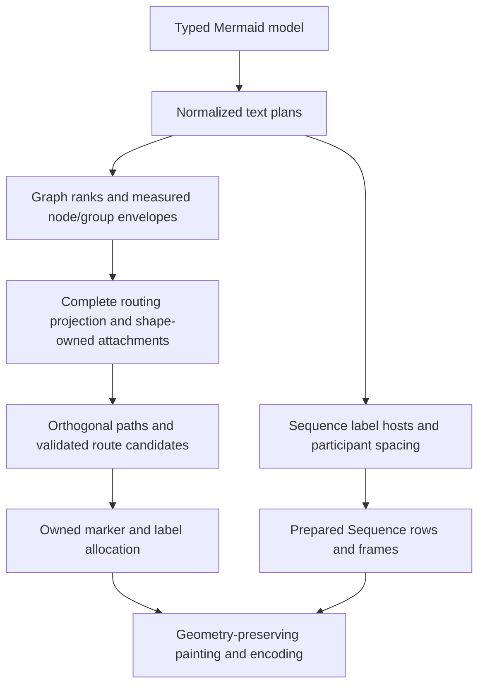

# ASCII geometry correctness and configurable node padding

## Scope and evidence

This document records the approved implementation design for issues #183 through #187.
The original investigation reviewed Merman checkout `292826512` before implementation.
The implementation outcome and verification are recorded at the end of this document.

The local `repo-ref/mermaid-ascii` checkout is `5f00e3d` (2026-09-08). It is a moving reference,
not the immutable copied-fixture authority: `SOURCE_PROVENANCE.tsv` identifies the baseline
`6fffb8e2714acab2c4cb41c78894fabbc62cee56` and supplement `876b5b44fcebb746e7aee09d3d19d0c059452621`.
Merman's Mermaid baseline is `mermaid@12.1.0`; use that local Git tag when inspecting Mermaid.
The checked-out Mermaid source identifies itself as 12.0.0 and must not silently substitute for
the pinned tag.

The previous investigation rebuilt the three-family CLI and reproduced all four reported bugs.
This investigation also built and ran the local Go reference. Captured output is available in
ignored scratch artifacts:

- `target/issue-183-187-reference-review.json`
- `target/issue-183-187-merman-extra-review.json`

| Case | Observed behavior | Consequence |
| --- | --- | --- |
| #183, Merman Canonical and Compact | The return lane touches the boxes; its head points upward, and the source connector overwrites a diamond shoulder. | Fix geometry and endpoint ownership before adjusting candidate preferences. |
| #184, Merman State and equivalent Flowchart | Independent labels become `submitchanges requested`. | Shared graph label occupancy needs reading clearance, not only disjoint painted cells. |
| #185, Merman and Go reference | The long message replaces the DB lifeline on its label row. | Reference output contains the same defect and is not a correctness oracle. |
| #185, Merman A-to-C message | `find user by id` fits before C but replaces B's intermediate lifeline. | An endpoint-span constraint alone is insufficient. |
| #185, Merman self message | A long self-message label replaces the next participant's lifeline. | Self-message labels need the same foreign-lifeline protection. |
| #186, Merman | Canonical is 54 columns by 11 rows; Compact is 48 by 11 and merges group corners. Auto at width 50 selects the broken Compact output. | Group envelopes must participate in spacing before routing. |
| #186, Go reference with paddingX=3 | The external frames close, but Deploy's left frame overlaps Staging's left border. | Moving only a group border is not a valid fix. |
| #187, Go reference with borderPadding=0 | The example becomes 12 columns by 19 rows. | This is useful prior art for opt-in padding, not evidence that all shapes and routes remain correct. |

The Go parser does not preserve the original #183 `B -- Yes --> C` syntax in this checkout:
it treats parts as node names. The additional equivalent reproduction uses `B -->|Yes| C` and
`B -->|No| A`; it routes the return edge visibly into the box. Its diamond is rendered as a
rectangle, so shape behavior remains a Merman-owned contract.

## Decisions

Preserve typed Mermaid models, Mermaid-backed ranking, compound ownership, existing character
width conventions, resource accounting, cancellation, and viewport selection. Refactor the
private graph geometry and route lowering where those interfaces currently lose information.
Keep Sequence's horizontal layout independent of graph routing. No new crate or general-purpose
layout solver is needed.



Layout profiles provide preferred spacing. Required structural spacing is a lower bound:
`effective_gap = max(requested_gap, geometry_requirement)`. Reducing padding or selecting Compact
must never authorize broken connectivity, overlapping sibling frames, or overwritten text.

## 1. Graph routing geometry: #183

### Current failure mechanism

- `graph/routing/path.rs::find_grid_path` searches up to six logical grid positions beyond the
  node grid extent.
- `graph/layout/grid.rs::AxisProjection::position` maps every index outside its represented
  extent to `total()`. `GraphLayout::grid_to_canvas` uses that projection for route waypoints.
  Distinct outside tracks can therefore collapse to the same terminal coordinate.
- `graph/routing/plan/grid.rs::plan_grid_line` excludes segment endpoints. A terminal segment
  with adjacent endpoints has no interior line cell. `plan_grid_path` drops that segment from
  both the line list and the direction list.
- Grid-route marker anchors use the first/last retained line directions, and `plan_grid_box_start`
  reconstructs a connector from the first retained line cell. These can describe a vertical
  transit segment instead of the intended horizontal endpoint attachment.
- `ProtectedGeometry::allows_endpoint_port` currently permits any point on an owning node's
  rectangular perimeter. It does not prove that the actual shape and selected port permit that
  attachment.
- Candidate scoring prioritizes cell cost and shared cells. It cannot repair geometry that
  already lost its terminal segments.

The Go reference's `increaseGridSizeForPath` explicitly sizes previously absent route bands
before projecting paths. This ownership principle is useful; its `paddingX / 2` formula and its
fallback synthetic line point are not a sufficient design for Merman's richer shapes and options.

### Required refactor

1. Give grid routes a complete routing projection. Explicitly resolve used corridor bands,
   including outside tracks, before terminal route lowering. Outside tracks must have distinct,
   resource-checked coordinates and enough room for endpoint escape and transit clearance.
   Preserve the coarse grid search; do not replace it with a dense terminal-cell A* search.
   Do not reserve an unbounded matrix or charge/render unused outside tracks as diagram content.
2. Let shape semantics resolve each attachment: border contact, side/normal, legal connector
   behavior, and the outside straight segment/marker berth. An incoming head points along the
   inverse of the target's outward normal. A diamond side vertex must not be replaced by a
   rectangular junction glyph on a shoulder.
3. Retain an ordered orthogonal geometric path and explicit attachments until glyph lowering.
   Adjacent points remain meaningful even if there is no ordinary stroke between them. Derive
   marker directions and connector positions from attachments, not retained stroke arrays.
4. Share attachment handling and geometric path lowering across the grid and analytic route
   families. Migrate the existing route helpers to that internal contract; remove superseded
   endpoint and direction reconstruction after migration. Preserve `RoutePlan`'s useful route
   ownership, marker requests, label hosts, and stroke/style behavior.
5. Protect transit clearance from node frames, with precise exceptions for the owning endpoint
   escape segment and permitted compound boundary crossings. Validate terminal straight runs,
   shape contacts, and clearance before cost comparison. Keep existing deterministic cost
   preferences among valid candidates rather than adding fixture-specific penalty weights.
6. Keep independent endpoint marker allocation. Any relocation remains on the same straight
   endpoint segment and preserves the target/source normal; it must not cross a bend or change
   the selected shape contact. If no legal berth exists, reroute within the existing bounded
   candidates or return the existing typed unsupported result.

## 2. Label reading clearance: #184

Keep separate concepts for painted label cells, pairwise label reading clearance, and permitted
intersection with the label's own host edge. A label may replace its own stroke at an admitted
host; unrelated labels, markers, and nodes remain protected.

Two independent labels on overlapping rows must leave at least one unoccupied terminal column
between their visible extents, or occupy different rows. Reserve horizontal reading clearance
once, not on both sides of both compared rectangles in a way that accidentally requires two
blank columns. Multiline labels use the same normalized row metrics as painting.

Use one clearance predicate in candidate feasibility and final label allocation. The current
`plan_label_candidate_is_clear` and `label_candidate_is_clear` checks must not diverge. Search
existing route-local alternate rows/sides deterministically; do not increase the search radius
as a substitute for a missing collision rule. Insufficient space remains an explicit failure,
not permission to concatenate or overwrite labels.

This fixes Flowchart, Swimlane, and State through their shared graph scene. Class and ER use a
separate relation-graph implementation and are not automatically included in this refactor.

## 3. Compound envelope spacing: #186

The current grid uses preferred node gaps, then constructs group bounds by expanding member
bounds. In this example each horizontal expansion is two cells, so a three-cell node gap cannot
contain both frame expansions plus a visible group gutter.

For two aligned sibling groups in the reported example:

```text
required_member_gap = left_group_overhang + right_group_overhang + visible_group_gutter
                    = 2 + 2 + 1 = 5 cells
```

Apply this requirement to the gap between groups while preserving the three-cell Compact gaps
inside each group. The width calculation predicts 50 columns by 11 rows for the corrected
example; this is an implementation target derived from geometry, not a measured fixed output.

Extend the existing rank/axis dimension planning with measured compound envelopes. Include
nested child frames, title dimensions, group padding, and their actual overhang. Enforce sibling
separation in each relevant parent scope and on the applicable axis; ancestor/descendant
containment is intentionally different from sibling separation.

Use the resulting coordinates for nodes, frames, route projection, and boundary attachments.
If a subtree moves, its entire contents move with it. Do not post-process output strings, widen
only a drawn frame, or move frame borders while retaining member coordinates. Keep one coordinate
authority and a bounded, resource-accounted resolution of geometry requirements.

## 4. Sequence label-host spacing: #185

`sequence/layout.rs::calculate_layout_with_policy` currently measures participant names and
fixed spacing. `sequence/event_plan.rs` plans message text later, and `event_paint.rs` writes it
onto a prebuilt lifeline row. Widening that output row does not widen the participant interval.
The Go reference has the same ordering. Mermaid's pinned `sequenceRenderer.ts` instead measures
messages before calculating actor margins; follow the measurement-before-placement principle.

For an unwrapped message assigned to a free label interval, require:

```text
right_interval_boundary - left_interval_boundary
    >= left_label_margin + normalized_label_width + right_label_clearance
```

Use a deterministic adjacent-lifeline interval on the message's horizontal span as the label
host. A leftmost interval is a reasonable default compatible with current label anchoring.
For nonadjacent endpoints, allocate width to that host rather than only increasing the full
source-to-target span: the latter still allows the label to erase intermediate lifelines.
Self-message labels use the interval before the next actor, or an outside right gutter when
there is no next actor. Include the self-loop's required geometry in that local clearance.

Implementation requirements:

- Prepare normalized unwrapped message metrics before assigning centers. Include authored text
  and numbering under existing normalization/break rules and the selected Unicode/CJK profile.
  Reuse the text plan in final row preparation; do not measure one spelling and paint another.
- Aggregate interval lower bounds and calculate centers once in participant order. Retain
  preferred Canonical/Compact spacing as the base lower bound. Adjacent host constraints do not
  require a general solver or a message-by-participant cross-product.
- Preserve explicit `wrap` semantics: unwrapped messages widen their host; wrapped messages use
  that host's available width and the existing safe wrapping rules. Do not impose implicit
  wrapping on unwrapped messages, or use natural unwrapped width to disable explicit wrapping.
- Calculate notes, group boxes, control frames, actor lifecycle rows, and final extents from the
  final centers. Reuse their current planners; do not add a second Sequence layout engine.
- Final label painting verifies its prepared host and foreign-lifeline protection. Increasing
  the output string buffer is allocation only and cannot satisfy a spacing constraint.

## 5. Configurable node padding: #187

Rust already exposes `AsciiRenderOptions::box_border_padding` and
`with_graph_padding_x`; bindings already expose the corresponding JSON options. The CLI lacks
these entries. The scalar box padding controls both axes, so wiring it alone does not provide
independent vertical compression.

Resolve one internal pair of node padding values. Add optional per-axis overrides and matching
builders/JSON fields; retain the public scalar as an intentional compatibility input, not a
second internal geometry path:

```text
resolved_node_padding_x = explicit_x.unwrap_or(box_border_padding)
resolved_node_padding_y = explicit_y.unwrap_or(box_border_padding)
```

Proposed CLI surface:

- `--ascii-node-padding <cells>` sets the scalar value for both axes.
- `--ascii-node-padding-x <columns>` and `--ascii-node-padding-y <rows>` override their axes.
- `--ascii-graph-padding-x <columns>` forwards to `with_graph_padding_x` and remains a preferred
  graph rank gap, independently constrained by labels, markers, and group envelopes.

Keep the current default of one cell/row. Zero is valid for node padding. All ordinary node
sizing, content placement, shape attachments, and resource checks consume the resolved pair.
Special fixed-size state symbols retain their shape semantics. Keep scope explicit: these node
settings apply to the shared Flowchart/Swimlane/State graph geometry, not unrelated participant
or table layouts. Mermaid CSS-pixel spacing options remain distinct.

Existing callers and JSON requests without the new fields keep their padding choices. An explicit
horizontal gap equal to the old default must still override Compact through the existing builder
convention. Update bindings and generated CLI help/man/completion artifacts with their current
tools; do not build new schema-inference scripts. Report width/height and viewport results from
the final geometry without adding a new transport metadata schema.

## Alternatives and trade-offs

| Approach | Benefits | Costs and failure modes | Decision |
| --- | --- | --- | --- |
| Increase constants, favor one back-edge helper, and expose the existing scalar flag | Small diff and immediate example improvements. | Leaves collapsed tracks, lost terminal segments, intermediate lifeline overwrites, and separate-axis padding unresolved. | Reject as the repair design. |
| Refactor private graph geometry/route lowering, add local Sequence host constraints, and keep thin configuration adapters | Repairs the underlying contracts while retaining existing semantic and resource infrastructure. | Several graph modules change; more semantic snapshots and resource-boundary checks are required. | Recommended. |
| Replace all text layouts with a universal rectangle/constraint solver or dense cell router | Potentially broader placement capabilities. | New abstraction and search cost across unrelated families; larger migration and resource risks without evidence that these five issues require it. | Reject for this scope. |

## Delivery units and acceptance

1. **Shared Graph correctness: #183, #184, #186.** Implement complete corridor projection,
   shape attachments, geometric path lowering, compound gap requirements, and label reading
   clearance. Add end-to-end reproductions and private plan invariant tests together.
2. **Sequence correctness: #185.** Add early text metrics and label-host interval constraints;
   cover ordinary, reverse, nonadjacent, self, wrapped, and numbered messages.
3. **Spacing controls: #187.** Resolve independent padding axes and wire Rust, JSON, and CLI.
   Validate zero padding against the repaired graph geometry, then refresh documentation and
   generated CLI artifacts.

| Acceptance criterion | Measurement |
| --- | --- |
| Reported #183 route enters the target side with a correctly oriented head and independent transit clearance. | Prepared attachment/path invariants plus Unicode/ASCII output regression. |
| All #184 authored labels occur once without concatenation or overwrites. | Both State and equivalent Flowchart reproductions, including unequal label lengths. |
| #185 preserves every relevant lifeline on message label rows. | Adjacent, A-to-C, self, reverse, numbered, and wrapped cases with terminal-cell checks. |
| #186 sibling frames are closed and separate, and their nodes remain inside. | Canonical, Compact, and Auto width 50; repeat with nested groups and direction transforms. |
| #187's three-node chain has 19 rows at zero vertical padding and unchanged vertical rank gaps. | CLI and Rust output; default padding still produces 25 rows. |
| One projection/measurement convention survives charset, width profile, and direction changes. | Focused ASCII/Unicode, Unicode/CJK, TD/BT and LR/RL cases. |
| Resource limits reject before unchecked expansion, and cancellation remains observable. | Existing exact-limit/max-minus-one and operation-cancellation tests for changed phases. |

Use serial Cargo invocations, appropriate `cargo nextest` suites, and `cargo fmt` during
implementation. Preserve the immutable copied reference fixtures. If corrected output differs
from an imported byte oracle that encoded unsafe geometry, document a narrow disposition and
add stronger semantic assertions; never classify missing topology or text as a permitted gap.
The copied Sequence fixture gap inventory must be updated only for verified changes.

## Risks and controls

- Route lowering touches rich marker and compound behavior. Keep endpoint ownership and boundary
  crossing tests, and migrate all affected route families to the same attachment contract.
- New corridor coordinates and padding alter extents. Charge checked arithmetic and layout work
  before allocation; use final geometry for both viewport preflight and painting.
- Compound-title wrapping can depend on available width. Resolve child envelopes and required
  spacing in a bounded order; do not introduce unrestricted layout/routing retry loops.
- Sequence spacing can change imported snapshots and Auto decisions. Treat complete, readable
  geometry as authoritative and verify each changed fixture instead of relaxing comparisons
  globally. Explicit-wrap height and complete fallback behavior remain covered.
- Public scalar padding already has users. Keep it as a documented compatibility input while
  private layout consumes only the resolved axes; this refactor does not require a public API
  removal or release-version change.

No claim is made that every possible graph admits a diagrammatic solution. The existing supported
subset must render correctly; when bounded valid candidate search is exhausted, retain explicit
errors instead of emitting a successful diagram with lost semantics. No performance improvement
is claimed without measurement. The design retains bounded coarse-grid routing and linear
Sequence interval aggregation; record representative graph work counts and Sequence timings
when implementing the changed planning phases.


## Implementation outcome

Implemented the five issues with shared shape attachments, checked transit projection, common
label reading clearance, pre-projection compound envelopes, adjacent-lifeline Sequence message
hosts, and independent node padding axes. Empty nested groups use the same measured envelope
for spacing and final frames. Coarse routing checks the actual compound boundaries and permits
only transverse interior-side crossings; the painted junction preserves the frame. All marker
candidates, including the primary berth, must lie on a straight terminal run.

The five original CLI reproductions now render successfully:

| Issue | Unicode extent | Selected profile | Verified property |
| --- | --- | --- | --- |
| #183 | 17 by 25 | Canonical | Diamond vertices survive; reverse route enters the target side. |
| #184 | 31 by 15 | Canonical | Both authored transition labels remain separate and complete. |
| #185 | 27 by 7 | Canonical | The complete message label preserves the foreign lifeline. |
| #186 | 50 by 11 | Compact under Auto width 50 | Sibling frames close and retain their contained nodes. |
| #187 | 14 by 19 | Canonical with vertical padding zero | Width and rank-edge gaps are preserved; default remains 25 rows. |

The 96 immutable copied fixture files retain their provenance digest. Five Sequence and seven
Graph cases have separately named corrected byte oracles, with explicit geometry assertions;
no copied fixture is replaced. Axis overrides are available through Rust builders, options JSON,
CLI flags, and TypeScript declarations. CLI completion/man artifacts were regenerated from the
release feature profile.

Validation completed on Windows with serial Cargo invocations and two build jobs:

- ASCII all-diagram nextest: 1361 passed.
- Shared bindings, WASM host tests, FFI, and UniFFI: 414 passed.
- CLI release-feature nextest: 497 passed; one pre-existing ignored test remains skipped.
- Clippy on the changed implementation owners and tests: no warnings.
- `merman-wasm` ASCII/all-diagram check for `wasm32-unknown-unknown`: passed.
- Web public-entry contract check and TypeScript no-emit check: passed.
- CLI asset generation, `cargo fmt`, and Git whitespace checks: passed.
- Independent Standards and Spec reviews: no unresolved findings.

The representative binding layout-work boundary is 3065, with 3064 producing the typed limit
error. Resource ceilings were not increased. Complete unwrapped Sequence labels may require
more width; the large offline fixture now explicitly proves Interactive rejection before using
the existing bounded TrustedNative profile. Debug CLI process timings for the five reproductions
were approximately 48–52 ms median over seven runs per case, including process startup; these
are validation observations, not evidence of a performance improvement.

## Corrective geometry review closure

The compound layout now measures complete subtrees in their immediate parent scopes. Empty
subtrees are translated as complete envelopes beside their actual sibling groups and direct
nodes; final frames reuse the same resolved bounds after one scene normalization. Anchored
nodes retain their coarse-grid projection. This preserves both fully empty root trees and mixed
parents without using foreign nodes to place an internal empty frame.

Graph terminals now resolve the painted contour, including LeanRight and LeanLeft row spans.
Drawing, multiline label placement, and attachments share that geometry. Both terminal normal
runs must be continuous; missing, bent, or duplicate cells reject the route candidate. Returning
bottom lanes contain the entire target terminal segment through ancestor group frames.

Marker berths are allocated when each canonical route is committed, so later candidates see
actual occupied heads. Only the same endpoint, contour contact, and normal may share that
terminal corridor. This retains finite existing route alternatives and restores the backlink
fixtures without adding a general assignment solver. Subroutine labels with zero horizontal
padding also preserve their inner decoration.

The new planning stages have independent exact/N-minus-one and phase-local cancellation
oracles: compound pair work is 6/5; Sequence early message planning is 70/69; the three-cell
terminal index admits its complete work before allocating storage. Failed operations preserve
resource ledgers and do not partially commit axis requirements.

The 96 copied fixture files and all named corrected byte snapshots remain unchanged. The
Issue #53 Canonical blank-cell characterization changes from 3220 to 3236 because the legal
side lane is shorter; both layouts retain all seven arrows, the same extents, and the existing
compactness assertions. The shared binding work boundary remains 3065/3064. No resource ceiling
or transport schema changes were needed.

Final corrective validation on Windows, using serial Cargo invocations and two build jobs:

- ASCII all-diagram nextest: 1376 passed.
- Bindings core, WASM host, FFI, and UniFFI nextest: 414 passed.
- CLI release-feature nextest: 497 passed; one existing ignored test remains skipped.
- Clippy with warnings denied, the real wasm32 target check, formatting, and whitespace checks:
  passed.
- Original five CLI cases and 56 review reproductions: successful and lossless; compound-only
  pressure cases: 192 passed.
- Independent Standards, Spec, route, and resource reviews: all confirmed findings closed.

Code review: harness-native fallback. The earlier CE orchestration did not yield a completed
review receipt; independent native review axes and specialist reviews supplied the final gate.
The unchanged coarse-rank limitation for a foreign node interleaved between two node-bearing
group members remains outside this empty-subtree repair; this change does not replace compound
ranking with a general layout solver.
