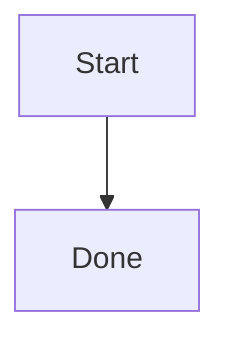

# Upgrading from 0.8.0-alpha.6 to 0.8.0-alpha.7

This guide describes the alpha.7 candidate. Alpha.6 remains the published workspace baseline during preparation; each registry and binary channel has its own publication step. Use alpha.7 examples with a matching source checkout until the exact package is published, then keep all coupled Merman dependencies and generated artifacts on that release. Alpha.7 is planned as the last alpha in the 0.8.0 cycle.

## Select diagram families in custom Rust builds

Default `merman`, CLI, and Rustdoc builds still include every family. Low-level crates and dependencies with defaults disabled now need explicit `diagram-*` selectors. Use `all-diagrams` to retain the old parser surface:

```toml
[dependencies]
merman = { version = "=0.8.0-alpha.7", default-features = false, features = ["all-diagrams", "ascii"] }
```

A Flowchart-only SVG integration can instead use:

```toml
merman = { version = "=0.8.0-alpha.7", default-features = false, features = ["diagram-flowchart", "svg"] }
```

`complete-svg` and `complete-svg-elk` select output/backend capabilities; neither selects languages when defaults are disabled. Family-specific public model types and enum variants are conditional. Review exhaustive matches and imports when narrowing features. `supported_diagrams()` lists compiled parsers, while `diagram_family_capabilities()` retains the full identity catalog with implementation flags. A detected but disabled family remains unsupported for strict parsing.

For lint and editor installations, include a family selection:

```console
cargo install merman-cli --version 0.8.0-alpha.7 --locked --no-default-features --features all-diagrams,analysis
cargo install merman-lsp --version 0.8.0-alpha.7 --locked --no-default-features --features all-diagrams,stdio
```

See [Features](../FEATURES.md#select-diagram-families) for custom registries and feature unification.

## Review Mermaid 12 presentation changes

The compatibility baseline advances from Mermaid 11.17.2 to 12.0.0. Flowchart, State, Class, ER, Requirement, Usecase, and Agentflow use ELK by default in ELK-enabled builds. Supported families also adopt Mermaid 12's `redux-color` theme and `neo` look. Geometry, colors, SVG IDs, and structure can change; regenerate snapshots after reviewing them.

Use top-level `layout` in place of `flowchart.defaultRenderer`, `class.defaultRenderer`, or `state.defaultRenderer`. For a Flowchart that should keep the previous layout and appearance choices:



These explicit choices do not promise byte-identical alpha.6 output: the parser and renderer also contain correctness fixes. Family-scoped settings and host `secure` policy still participate in configuration resolution. Lean builds without ELK retain their documented fallback; an explicit ELK request requires the matching compiled capability.

## Choose the compiled layout dependency

The default `merman`, `merman-cli`, and `merman-rustdoc` source builds now include `merman-elk-layered`, which is EPL-2.0. Merman's own code remains MIT OR Apache-2.0. Full CLI and native/Web/Node artifact recipes already included ELK before this source-default change; their included notices describe their dependency closure.

For SVG, Cytoscape, and math without ELK in a Rust facade dependency, select:

```toml
merman = { version = "=0.8.0-alpha.7", default-features = false, features = ["all-diagrams", "complete-svg"] }
```

Cargo features are additive. Check the final application graph with `cargo tree -e features -i merman-elk-layered`; another dependency can enable ELK even when this declaration does not. Runtime `layout: dagre` changes the chosen algorithm but does not remove compiled dependencies. Preserve the legal materials for the artifact you distribute; see [Third-party notices](../../THIRD_PARTY_NOTICES.md) and [Package surfaces](PACKAGE_SURFACES.md).

## Update Rustdoc integration

`merman-rustdoc` defaults to all families, SVG, Cytoscape, and ELK, with math now opt-in. For mathematical labels, add `features = ["math"]` to the dependency. The separate `merman` facade still includes math by default.

Macro SVG backgrounds are now transparent. Set `background = "white"` if a document needs the previous opaque canvas. Generated IDs include occurrence and theme identity; refresh generated output and avoid depending on historical IDs. Use `id_prefix` for otherwise identical methods emitted by one declarative macro, or annotate complete impl trees.

Nested Markdown containers are supported, but standalone `include_mmd!` lines must carry explicit list/blockquote prefixes and JSON-compatible quoted paths. Duplicate options are errors. The `inherit` option controls parent rendering defaults; `scope` remains local. For automatic `.mmd` rebuilds, use the documented consumer `build.rs` directory watch. See the [Rustdoc guide](../../crates/merman-rustdoc/README.md).

## Upgrade ASCII decoders and native wrappers

ASCII output reports use schema `3`. They distinguish requested and effective layouts and report whether Compact was attempted. Opt-in `auto` retries Compact for bounded Flowchart/Sequence output before the configured overflow policy; existing explicit Canonical and Compact choices remain available.

| Surface | Alpha.7 contract | Required action |
| --- | --- | --- |
| Rust and JSON consumers | ASCII report schema 3 | Refresh typed records, exhaustive matches, and strict decoders |
| Python | UniFFI API 7; `binding_api_version_v7()` | Regenerate wrappers and native libraries together |
| Apple | UniFFI API 7; `bindingApiVersionV7()` | Regenerate Swift and replace the matching XCFramework |
| Flutter/C | C ABI remains 3 | Upgrade facade/native artifacts together and refresh ASCII payload decoders |
| Android | JNI transport API remains 2 | Use Kotlin and native slices from the same AAR; refresh custom JSON decoding |
| Web/WASM | Transport API remains 5 | Use glue and WASM from the same package version; refresh ASCII decoders where supported |

The unchanged transport numbers are not permission to mix payload schemas. Node's current distributed recipe does not include ASCII. Generic UniFFI requests retain the `MermanOperationRequestV4` name.

## Adopt Agentflow and Usecase by capability

Both families support native parsing, semantic models, layout, and SVG, with Playground, Tree-sitter, lint/diagnostic, and LSP/editor integration. Agentflow adds diagnostics for removed or unsupported shapes and cyclic containment. Agentflow follows upstream beta syntax, body completion remains limited, and neither family has an ASCII projection. Inspect runtime family/output capabilities rather than inferring terminal support from SVG support.

The independent grammar package advances to `tree-sitter-mermaid` / `@mermanjs/tree-sitter-mermaid` `0.2.0`. Consumers with custom queries should use its [query migration guide](../../distribution/tree-sitter-mermaid/docs/query-migration.md). Its Cargo package must be published before the workspace LSP package that requires it; the workspace tag does not publish the grammar.

## Review custom package tooling

Custom artifact-profile readers must adopt `capabilities/artifact-profiles-v2.json` schema `2`, including `expected.diagram_families`. Use the owner descriptors and runtime catalog to distinguish parsing from rendering or editor coverage. Workspace-coupled prerelease dependencies use exact version requirements; do not mix alpha.6 facades with alpha.7 implementation crates.

## Scope and remaining limits

The reusable theme refactor announced in alpha.6 is deferred to a future release because implementation scope, code size, and performance need more work. Mermaid 12 theme compatibility and the targeted theme fixes ship independently of that larger redesign. The remaining 0.8.0 work is focused on stabilization.

The default headless measurer remains deterministic and font-agnostic. A display font can exceed estimated geometry, including the documented Flowchart title residual. Hosts with font access can use `DeterministicTextMeasurer::with_width_callback(...)` or the binding's text-measurement provider. See the [font-boundary report](../alignment/MERMAID_12_TITLE_029_FONT_BOUNDARY_2026_09_30.md); no universal browser containment guarantee is introduced by this release.
