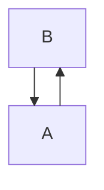

# Upgrading from 0.8.0-alpha.7 to 0.8.0 (unreleased)

This guide describes the development target as of 2026-10-02. **Merman `0.8.0` is not released.**
Implementation, reference-artifact refresh, and validation are in progress; this document does not
claim that every release gate has passed or that any package channel has published. Keep using the
[alpha.7 guide](ALPHA6_TO_ALPHA7_UPGRADE_GUIDE.md) and matching tagged documentation for the published
release. Earlier upgrades are listed in the [versioned index](README.md).

## Selected compatibility graph

| Upstream component | Alpha.7 baseline | Unreleased target |
| --- | --- | --- |
| Mermaid | `12.0.0`, commit `98a0945418c76238f15df2afaddbba4272656c3b` | `12.1.0`, commit `21f72f07ea22c0af48a3149c550654e80d8e40cb` |
| Mermaid parser | `@mermaid-js/parser@2.0.0` | `@mermaid-js/parser@2.0.1` |
| Reference CLI | `@mermaid-js/mermaid-cli@11.17.0` | `@mermaid-js/mermaid-cli@12.0.0` |

Other selected companions do not change as part of this baseline transition. The reference CLI is
an upstream comparison tool; its version is not the Merman CLI version. The exact selected source,
package, integrity, and decision receipt live in
[`MERMAID_REFERENCE_BUNDLE.json`](../../tools/upstreams/MERMAID_REFERENCE_BUNDLE.json).

No diagram families or Cargo features are added. The FFI and editor-facts schema versions do not
change. Coupled Rust crates, generated wrappers, and native/WASM artifacts must still come from
one matching Merman build. The independent Tree-sitter package keeps its own baseline and release
process; the parent Mermaid upgrade does not promote its grammar or query contract.

## Review ELK output changes

The Mermaid 12.0 defaults introduced in alpha.7 remain: ELK is the default for its supported
families when compiled in, and supported families retain the `redux-color` theme and `neo` look.
The compiled ELK capability and its EPL-2.0 notice obligations are unchanged.

Mermaid 12.1 adds `elk.orientFeedbackEdges`, enabled unless explicitly `false`. The adapter can
orient feedback edges for compound layout and then restore their semantic direction and routed
endpoints. Cyclic and cross-container geometry may therefore change. To disable this new pass:



This setting disables the feedback-orientation pass; it does not undo other correctness fixes or
promise byte-identical alpha.7 output. Review affected diagrams before replacing snapshots.

The current ELK work also corrects cyclic-entry selection, nested drawing frames, local fork/join
direction, group-title wrapping, relationship labels, and container paint order. Class cardinality
labels now retain terminal identity through routing. Namespace backgrounds no longer hide Class
relationships; ER parents precede descendants. Class, ER and Requirement respect native SVG label
mode, and Requirement body text follows ELK's left alignment.

Class, ER, Requirement and Usecase now honor `elk.lineHops`. Crossing rewrites retain label and node
placement while updating path geometry and Neo stroke masks, including dashed and gap styles.
Disabled hops leave paths untouched. Closely spaced crossings can still trigger the upstream
path/style rewrite even when there is no room for a visible arc.

These changes affect SVG structure, identifiers, geometry and styles. Preserve semantic assertions
and inspect the output change before refreshing SVG or layout goldens. Browser font measurement,
`foreignObject`, and RoughJS residuals remain subject to the documented
[parity boundary](../workstreams/PARITY_BOUNDARY.md).

## Review Packet and XYChart presentation changes

Mermaid 12.1 changes two drawing policies that can alter SVG coordinates without changing the
semantic model:

- **Packet:** `packet.bitOrder: descending` mirrors each row independently. Fields keep their
  declared inclusive ranges and widths, but a block starts at the mirrored column; its left and
  right numbers are `end` and `start`. A partial row is flush right, and a single-bit field stays
  centered. `showBits: false` hides the numbers but keeps the mirrored field positions.
- **XYChart:** the chart title gets a separate row above the plot and legend. It is centered over
  the final plot interval, excluding axis and legend width, then clamped so the measured title stays
  inside the chart. A title wider than the chart is centered on the chart without wrapping. If the
  measured title plus both `titlePadding` margins does not fit in the height remaining after plot
  reservation, the title is omitted entirely.

The corresponding source contracts are `packet/renderer.ts` and
`xychart/chartBuilder/components/chartTitle.ts` in the selected Mermaid source. These are rendering
policies; Packet ranges and XYChart data remain unchanged.

## Update direct low-level ELK Rust consumers

Facade rendering requests do not require the following constructors. They apply to integrations
that build or inspect the public graph types in `merman-layout-elk` or `merman-elk-layered` directly.
These are source-breaking struct changes; no compatibility aliases are retained.

### Mermaid adapter graph and result types

`merman_layout_elk::Edge` adds `terminal_labels: Vec<TerminalLabel>`. Existing edges without
terminal labels must initialize it to `Vec::new()`; `Edge` does not implement `Default`.
`EdgeLabelLayout` adds `terminal: Option<TerminalLabelKey>`; use `None` for a center label.

```rust
use merman_layout_elk::{Edge, EdgeLabelLayout};

let edge = Edge {
    id: "A-B".to_owned(),
    source: "A".to_owned(),
    target: "B".to_owned(),
    label: None,
    terminal_labels: Vec::new(),
    minlen: 1,
    inside_self_loops_yo: false,
};

let center_label = EdgeLabelLayout {
    terminal: None,
    x: 0.0,
    y: 0.0,
    width: 40.0,
    height: 16.0,
};
```

For terminal labels, `TerminalLabel` contains `key: TerminalLabelKey` and `label: Label`.
`TerminalLabelKey` has `StartLeft`, `StartRight`, `EndLeft`, and `EndRight`; `ALL`, `at_start()` and
`on_right()` are available. Returned terminal labels have `terminal: Some(key)`. Select a center
label by `terminal.is_none()` instead of assuming every entry is a center label. Non-layered
providers leave terminal labels unplaced.

The provider's terminal-label dimensions include the reserved marker space. Class's higher-level
`LayoutLabel` continues to describe the actual text dimensions. Keep those two geometry contracts
distinct when inspecting low-level output.

### Layered importer and kernel labels

| Public type | Previous initializer | New initializer |
| --- | --- | --- |
| `merman_elk_layered::ElkInputEdge` | `label: None` | `labels: Vec::new()` |
| `merman_elk_layered::ElkInputEdge` | `label: Some(label)` | `labels: vec![label]` |
| `merman_elk_layered::ElkInputLabel` | Struct literal without a source identity | Add `source_index: None` for an ordinary center label |
| `merman_elk_layered::LLabel` | Struct literal without a source identity | Add `source_index: None` for an ordinary center label |

`ElkInputEdge.label` is removed in favor of `labels: Vec<ElkInputLabel>`. `ElkInputNode.label`
remains unchanged. `ElkInputLabel::center(...)` and `LLabel::new(...)` initialize `source_index`
to `None`, so callers using those constructors do not need an extra assignment. A populated
`source_index` is an opaque caller-owned identity preserved through label processing; use the
adapter's typed terminal keys when working at the Mermaid adapter layer.

Update direct struct literals and exhaustive destructuring before compiling against the new
source. Upgrade the coupled implementation crates together.

## Review source and configuration behavior

- **Flowchart:** repeated subgraph IDs merge into one semantic container while retaining the
  declaration locations for editor operations. Self-membership is removed; first-completed group
  title/direction and subsequent metadata follow the upstream parser contract.
- **Sequence:** actor/participant `@{...}` configuration accepts intervening inline whitespace and
  IDs containing hyphens or equals signs. Keyword-like IDs such as `Link`, `Links`, `Properties`,
  and `Details` retain their spelling in explicit declarations and messages. Existing menu
  declarations remain available.
- **Eventmodeling:** duplicate frame IDs now reject strict parsing, including IDs reused by reset
  frames. Diagnostics retain original source locations through comments and frontmatter. Reset
  frames keep explicitly named `->>` sources; a reset frame without sources does not infer a
  relation from the preceding frame.
- **Usecase:** incomplete declarations and edges at end of input retain an exact EOF location
  through strict, typed-render and editor routes. No grammar expansion is introduced by this fix.
- **Themes:** partial object-valued overrides retain generated sibling keys across all 11 themes.
  For example, changing only `themeVariables.xyChart.titleColor` keeps the chart's generated
  palette and axis colors. The final replay is a shallow merge: an explicitly supplied nested
  value replaces that value, while scalar and array overrides retain replacement semantics.
- **Error presentation:** suppressed parse failures carry their actual error message into the
  error diagram. Messages wrap at 75 Unicode code points for up to four lines, with an ellipsis
  for overflow and a corresponding viewport-height adjustment. An explicit error diagram without
  a parse error keeps its existing message-free form. Frontmatter detection and extraction share
  the source-backed linear scanner.

The semantic parser continues to own editor and LSP facts. No second grammar, transport-specific
parser, or new editor schema is introduced for these changes.

## Validate an upgrade

1. Update coupled source dependencies and any direct low-level ELK initializers together.
2. Exercise affected cyclic/nested diagrams, Class terminal labels, native SVG labels, and partial
   theme overrides. Include invalid Eventmodeling IDs and incomplete Usecase input in diagnostic
   tests.
3. Compare semantic assertions, layout output and SVG DOM using the selected reference graph.
   Refresh artifacts only after reviewing their source-backed differences.
4. Run the applicable package and host integration checks with matching generated wrappers and
   artifacts. Use the [Mermaid upgrade playbook](MERMAID_UPGRADE_PLAYBOOK.md) for repository gates.

At this checkpoint, the full validation and publication work is still in progress. This guide does
not replace the selection receipt, strict gate results, or per-channel publication evidence.
