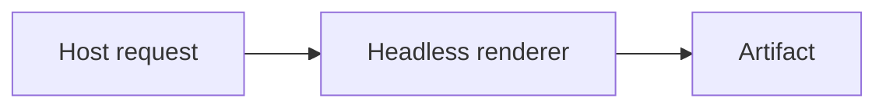

# Headless Library Boundaries and Host Integration Research

## Decision

Do not add a second unified theme model, `TerminalRenderProfile`, `AgentPreset`, or a terminal-context framework in response to the current request. Existing APIs already express the three concrete integration scenarios below. The demonstrated gap is that callers must assemble information spread across presentation, ASCII, binding, and package documentation. A focused integration guide and executable recipes are justified; a new public abstraction is not yet justified.

This corrects the premise that Merman still needs basic host theming or terminal roles. `HostTheme`, `Presentation`, presentation profiles, terminal palettes, semantic ASCII roles, ANSI16 terminal-default styling, and JSON palette input already exist. The August 26 research records the terminal architecture work as implemented; its original problem statements are historical, not a fresh backlog. [M1–M5]

## Evidence scope and limitations

- Inspection date: September 12, 2026. Merman HEAD was `796915065cf7e4eadbb4e2d328c8a4372f6a9e63`; the working tree includes ongoing changes, so this report describes inspected files rather than claiming that all behavior is in a published release.
- The local Grok Build checkout was `37949780c144e37df692e3d669051a21fec24f20`. It is a source snapshot, not a claim about the latest upstream release. The earlier August 26 report inspected a different revision, `c2ad97f87aea4303b6000a2c22128bc91ee76c9b`; its measurements are not new measurements of this checkout. [M5]
- The comparison is source-backed responsibility and API analysis. It does not measure rendering speed, memory, crash containment, visual quality, or complete Mermaid family parity between projects. No conclusion that one engine is generally superior follows from it.
- The existing local CLI binary successfully exercised the three command shapes below. It was not rebuilt during this research, and these smoke checks do not establish release/package compatibility. The reported schema and metadata were observed directly.
- Grok lives under the ignored `repo-ref/` reference area. Its source paths are useful in a maintainer checkout; public consumers should not need that reference checkout to follow the recommended Merman guide.

## What is already implemented

| Concern | Existing mechanism | Implication |
| --- | --- | --- |
| Host colors and typography for SVG | `HostTheme`, bundled presets, semantic `ThemeRole`, font and series palette input | Reuse the current presentation compiler. Do not introduce another global theme record. [M1] |
| Presentation behavior | `PresentationProfile::MermanModern` independent of theme and SVG pipeline | Do not overload a theme selection to enable ELK, change geometry, or choose a consumer pipeline. [M1] |
| Mermaid configuration precedence | Engine defaults, presentation defaults/theme, explicit `site_config`, then source-local configuration | A recipe must explain precedence; the existing architecture already owns it. [M1] |
| ASCII host palette | `AsciiTerminalPalette`, `AsciiColorTheme::from_terminal_palette`, role overrides, `ascii.theme` JSON | The terminal palette path is available in Rust and the shared binding parser. [M2–M4] |
| Terminal-default color | ANSI16 Reset-based role mapping and named accents | Unknown terminal appearance does not require an invented RGB theme or renderer probing. [M6] |
| Explicit fitting | `AsciiViewportPolicy`, Canonical/Compact/Auto, separate overflow policy | Host supplies width; family capability decides whether Auto is available. [M7] |
| Machine result | Schema-3 report, actual/requested layout profile, encoding, extents and fallback metadata | Consumers branch on fields instead of scanning text or ANSI bytes. [M7] |
| Resource and cancellation contract | `OperationControl`, per-operation resource policy and typed facade errors | Preserve errors across transports; do not silently reinterpret resource failures as display fallback. [M8] |
| Output artifact selection | Typed SVG, ASCII, PNG/JPEG/PDF requests and feature-gated backends | The host chooses a target and handles storage/display; the library returns artifacts and evidence. [M8] |

The current SVG and ASCII theme inputs have related colors but different semantics. SVG owns typography, CSS-adjacent family variables, fills and presentation compilation. ASCII owns display-cell geometry and terminal role encoding. A host can map its own palette into both. The need to write that mapping once is not itself evidence that Merman needs a universal theme type. [M1–M4]

## Constraints recipes must state explicitly

### Styled output and fallback are separate choices

Viewport `fallback` is currently Plain-only and validated before rendering. ANSI16, ANSI256, TrueColor and HTML primary output can use `allow` or `error`; requesting styled output plus `fallback` is invalid even if a particular diagram would fit. Auto does not relax this rule. CLI `--ascii-report` is also a Plain-only machine channel. [M7]

A styled host that wants a plain retry must own an explicit second request and its user-visible policy. It must not retry cancellation, deadline or resource exhaustion as if they were ordinary width errors. A library recipe should usually choose Plain plus fallback for bounded machine consumption, avoiding an unnecessary second-request policy. [M7–M8]

### ANSI16 is not the RGB palette encoder

`CanvasColor::resolve_ansi16` deliberately maps primary text, surfaces and most structural roles to terminal default colors, and selected emphasis roles to named colors. It does not resolve semantic roles through `AsciiColorTheme`. Direct authored RGB colors are quantized separately. TrueColor and ANSI256 resolve the supplied RGB theme through their own encoder path. Therefore a recipe promising that `ascii.theme` controls exact foreground/background RGB must select TrueColor, or explain ANSI256 approximation; it must not show ANSI16 and imply the same palette fidelity. [M6]

Reset and named colors retain terminal ownership of the palette. They are not a guarantee that every user-customized terminal palette satisfies a particular contrast ratio.

### Auto is family-specific

Only Flowchart and Sequence currently admit `auto` and `compact`. Every other supported ASCII family is canonical-only. A generic host should read capability records and select Auto only when present, using Canonical otherwise. Explicit width is required for Auto. Narrower candidates can be taller; very long edge labels can remain wide. [M7]

### Package support is not workspace-wide support

The documented shipped native `@mermanjs/node` recipe provides SVG with Cytoscape and ELK. It excludes ASCII, math, binary export and analysis. The native transport Cargo feature list has no ASCII forwarding feature. Do not publish a coding-agent recipe that calls ASCII on this native package merely because `merman-ascii` and shared binding parsers exist elsewhere in the workspace. A Rust/CLI integration is an established ASCII path; a Web/WASM recipe must separately verify its artifact capabilities. [M9]

## What Grok Build actually contributes to this comparison

The local Grok renderer provides useful examples of separation: a cell renderer returns styled and plain lines, while pager code owns a separate affordance row and on-demand PNG actions. Its inline parser/layout includes fixed bounds (`MAX_NODES`, `MAX_EDGES`, canvas cells), a 24-column label wrap and a four-line truncation policy. Unsupported or over-wide rendering uses a framed source fallback. Those are deliberate product choices, not a general Mermaid semantic contract for Merman to adopt. [G1]

The pager adds `Open Image`, `Copy Image Path`, and `Copy Source`. PNGs are not drawn inline by that policy; the OS viewer handles them. Cache identity includes source, theme, width bucket and quality tier. Worker code owns filesystem paths, subprocess timeouts, killing/reaping children and action failure handling. These belong to a pager integration because they depend on its session, UI, process and storage model. [G2–G4]

Merman should learn from explicit bounds and separation without copying Grok's parser, lossy truncation, source disclosure or pager state. The present evidence supports this boundary; it does not show that Merman is missing a theme engine, nor that Grok's remaining differences are only theming.

## Three executable integration scenarios

These use existing CLI/API surfaces. A documentation implementation should turn them into maintained recipes, with sample input and exact artifact requirements, rather than new preset identifiers.

Use this `diagram.mmd` input:



### 1. Coding-agent machine channel or log

The host supplies a known width and accepts Plain structured fallback. This sample is explicitly Flowchart, so Auto is admitted:

```text
merman-cli render diagram.mmd --format unicode --ascii-layout-profile auto --ascii-max-width 80 --ascii-overflow fallback --ascii-color plain --ascii-report --output -
```

The local stdin-equivalent smoke check returned schema 3, `encoding: "plain"`, `outcome: "primary"`, requested `auto`, selected `canonical`, `compact_attempted: false`, and an emitted extent of 59 by 5 cells. A real generic consumer should preflight family capabilities rather than use Auto unconditionally. It should consume typed error JSON/metadata rather than infer failures from the diagram text. [M7]

The existing Rust [`render_terminal.rs`](../../crates/merman/examples/render_terminal.rs) already demonstrates `AsciiRequest`, an explicit 80-column viewport and typed fallback outcome. Extend or link that example instead of creating a parallel request wrapper.

### 2. Human terminal or pager with host-owned appearance

For terminal-default styling, choose ANSI16 and a width error policy:

```text
merman-cli render diagram.mmd --format unicode --ascii-layout-profile auto --ascii-max-width 80 --ascii-overflow error --ascii-color ansi16 --output -
```

The local smoke check exited successfully and emitted ANSI escapes. On a width error, the pager decides whether to scroll, display source or submit a separate Plain request. The renderer does not infer that choice. On a pipe/log destination, the host should choose Plain or let the CLI resolve its existing auto-color behavior; bindings reject environment-dependent `color_mode: "auto"`. [M7, M10]

For a host with a known RGB palette, use the existing Rust palette path instead:

```rust
let theme = AsciiColorTheme::from_terminal_palette(
    AsciiTerminalPalette::new(foreground, background).with_accent(accent),
);
let options = AsciiRenderOptions::unicode()
    .with_color_mode(AsciiColorMode::TrueColor)
    .with_color_theme(theme);
```

This is an API composition fragment, not a separately compiled example in this research. The Rust types/builders exist, and shared-binding tests already exercise TrueColor `ascii.theme` and invalid-color rejection. The implementation plan should make a self-contained runnable host-palette example, reusing `render_terminal.rs` request assembly. [M2–M4]

### 3. Editor preview and optional image export

A browser/Webview preview can select a Mermaid theme and parity SVG explicitly:

```text
merman-cli render diagram.mmd --format svg --theme dark --svg-pipeline parity --output -
```

The local smoke check returned SVG successfully. The host owns browser DOM admission and insertion; parity is not a sanitization guarantee. For semantic host colors rather than a Mermaid theme name, the existing [`custom_presentation_theme.rs`](../../crates/merman/examples/custom_presentation_theme.rs) demonstrates `HostTheme` and `Presentation`; its present example deliberately selects a resvg-safe policy, which a recipe must explain rather than silently call a browser default. [M1, M11]

For PNG, use the typed PNG export target or CLI `--format png` in an artifact with binary export enabled. Its validated SVG/export path should own raster compatibility; the editor owns save/open/copy actions. Do not imply that the native Node package includes binary export. PNG was not executed during this research. [M8–M9]

## Recommended documentation-first implementation scope

1. Add one host-integration guide linking existing API authorities. Organize it around the three scenarios, including family capability preflight, package availability, Plain-only fallback, ANSI16 versus RGB palette semantics, and host-owned display decisions.
2. Maintain one runnable terminal palette example using current APIs. Reuse or extend existing terminal/example conventions; do not add a generic policy factory merely to shorten a recipe.
3. Cross-link `presentation-themes.md`, the ASCII README, binding options and package guides so SVG host theme versus terminal palette is discoverable without implying automatic cross-target synchronization.
4. Validate recipe behavior with the existing focused test mechanisms: valid Plain fallback, styled fallback rejection, unsupported-family Auto rejection, palette application in TrueColor, and existing report metadata. Avoid duplicating the whole renderer matrix or adding source-inspection scripts.
5. Keep production APIs, schemas, defaults, package features and output policies unchanged unless a concrete runnable recipe exposes an actual blocker. Record that blocker and its consumer before proposing an API change.

A future convenience constructor is justified only if multiple real hosts repeat the same nontrivial policy resolution and current composition causes errors that documentation cannot reasonably prevent. A universal theme bridge needs a concrete cross-target mapping requirement and precedence contract first. Neither condition has been established by this research.

## Source index

All line anchors below refer to the inspected working-tree snapshot; line numbers may move.

- **M1:** [`docs/rendering/presentation-themes.md`](../rendering/presentation-themes.md), lines 3–11 (independent axes), 50–73 (roles/presets/profile), 107–123 (precedence/discovery).
- **M2:** [`crates/merman-ascii/src/color.rs`](../../crates/merman-ascii/src/color.rs), lines 39–118 (roles/palette), 213–265 (palette derivation); [`options.rs`](../../crates/merman-ascii/src/options.rs), line 294 (theme builder).
- **M3:** [`crates/merman-ascii/README.md`](../../crates/merman-ascii/README.md), lines 121–128 (terminal palette and binding boundary).
- **M4:** [`crates/merman-bindings-core/src/ascii.rs`](../../crates/merman-bindings-core/src/ascii.rs), lines 237–259 (palette compilation), 905–930 (TrueColor/invalid-color tests).
- **M5:** [`2026-08-26-ascii-terminal-layout-visual-hierarchy-themes.md`](2026-08-26-ascii-terminal-layout-visual-hierarchy-themes.md), executive conclusion and implemented sequence; [`2026-08-26-1451-refactor-ascii-terminal-layout-theme-architecture-plan.md`](../plans/2026-08-26-1451-refactor-ascii-terminal-layout-theme-architecture-plan.md), R6, KTD5, KTD8 and deferred styled fallback. The research closeout distinguishes completed work from the plan's historical problem frame.
- **M6:** [`crates/merman-ascii/src/terminal.rs`](../../crates/merman-ascii/src/terminal.rs), lines 157–200 (RGB versus ANSI16 resolution); [`canvas.rs`](../../crates/merman-ascii/src/canvas.rs), lines 1433–1505 (dedicated encoder), 2981–3028 (named accents, Reset text and direct RGB tests).
- **M7:** [`docs/bindings/OPTIONS_JSON.md`](../bindings/OPTIONS_JSON.md), lines 370–430; [`docs/rendering/ASCII_SUPPORT_MATRIX.md`](../rendering/ASCII_SUPPORT_MATRIX.md), capability dimensions and viewport/report contract.
- **M8:** [`README.md`](../../README.md), lines 134–161 (determinism, resources and output chain); [`crates/merman/src/render.rs`](../../crates/merman/src/render.rs), lines 346–388 (resource contract), 528–615 (target/request/output types).
- **M9:** [`platforms/node/README.md`](../../platforms/node/README.md), lines 60–74 (shipped recipe and separate transports); [`crates/merman-node/Cargo.toml`](../../crates/merman-node/Cargo.toml), lines 14–20 (feature surface).
- **M10:** [`crates/merman-cli/src/invocation.rs`](../../crates/merman-cli/src/invocation.rs), lines 1337–1347 (Plain report enforcement), 1429 onward (host color resolution).
- **M11:** [`platforms/node/README.md`](../../platforms/node/README.md), lines 36–59 (SVG pipeline and host admission boundary); [`custom_presentation_theme.rs`](../../crates/merman/examples/custom_presentation_theme.rs), lines 15–45 (host theme and explicit output policy).
- **G1:** [`repo-ref/grok-build/crates/codegen/xai-grok-markdown/src/mermaid.rs`](../../repo-ref/grok-build/crates/codegen/xai-grok-markdown/src/mermaid.rs), lines 11–44 (styles/caps), 55–87 (render dispatch and fallback).
- **G2:** [`repo-ref/grok-build/crates/codegen/xai-grok-pager-render/src/appearance/render_mermaid.rs`](../../repo-ref/grok-build/crates/codegen/xai-grok-pager-render/src/appearance/render_mermaid.rs), lines 1–17 (affordance preference).
- **G3:** [`repo-ref/grok-build/crates/codegen/xai-grok-pager/src/scrollback/blocks/mermaid_content.rs`](../../repo-ref/grok-build/crates/codegen/xai-grok-pager/src/scrollback/blocks/mermaid_content.rs), lines 5–9 (image actions), 130–190 (cache identity).
- **G4:** [`repo-ref/grok-build/crates/codegen/xai-grok-pager/src/app/mermaid_worker.rs`](../../repo-ref/grok-build/crates/codegen/xai-grok-pager/src/app/mermaid_worker.rs), lines 18–27 (process containment), 63–85 (budgets), 267–339 (subprocess execution and outcomes).
