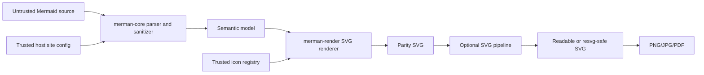

# Security Threat Model

**Status**: Living document  
**Last updated**: 2026-06-17  
**Scope**: `merman-core`, `merman-render`, `merman`, and `merman-cli`

## Problem

`merman` renders user-authored Mermaid text without a browser. That removes browser-execution
surfaces such as Mermaid runtime callbacks, but the project still emits SVG, CSS, links, optional
HTML labels, raster images, and host-provided theme/icon content.

The main security goal is to make untrusted diagram source safe by default while preserving Mermaid
parity for consumers that intentionally need Mermaid-like SVG output.

## Architecture

## Trust Boundaries

| Boundary | Trust level | Notes |
| --- | --- | --- |
| Mermaid source text | Untrusted | Includes labels, click URLs, class/style directives, frontmatter, and `%%{init}%%`. |
| Diagram-level config | Untrusted by default | Default `secure` keys prevent diagrams from changing high-risk config such as `securityLevel`, `fontFamily`, `themeCSS`, and `themeVariables`. |
| Site config | Trusted | Supplied by the embedding application. Use it for host policy, theme, and trusted CSS only. |
| Host theme and custom SVG pipeline | Trusted | Custom postprocessors can inject or preserve arbitrary SVG/CSS. |
| Icon registry | Trusted | `IconSvg` bodies are injected as SVG fragments after ID scoping. Do not register user-supplied SVG without an external sanitizer. |
| Parity SVG output | Not a browser sanitizer | It preserves Mermaid-like DOM shape and may contain CSS or `<foreignObject>` needed for parity. |
| `resvg_safe` output | Consumer-oriented cleanup | It removes known raster/SVG consumer hazards, but it is not a complete browser XSS sanitizer. |

## Current Mitigations

| Threat | Mitigation | Coverage |
| --- | --- | --- |
| Diagram config downgrades `securityLevel` or injects CSS through config | Default secure keys filter diagram-level overrides before effective config is used. | Core parse metadata and public render API tests. |
| Script or data URLs in labels and links | Mermaid-compatible `format_url` and `sanitize_url` logic, strict by default. | Core URL tests plus SVG integration tests. |
| HTML/script in labels | DOMPurify-inspired text sanitizer backed by generated allowlists when full sanitization is enabled. | Core sanitizer tests. |
| `<foreignObject>` and unsupported CSS in raster paths | `SvgPipeline::readable()` adds text fallbacks; `SvgPipeline::resvg_safe()` strips foreignObject and unsupported CSS patterns. | Pipeline tests and public API regression tests. |
| Huge or malformed raster output | Raster options include default pixmap limits and fit/scale controls. | Raster tests and CLI behavior. |
| Parser/layout denial of service | Diagram-specific guards such as text-size, edge-count, nesting, and Gantt exclude expansion limits. | Core/render unit tests. |
| Raw style declaration breakouts | SVG style declaration helpers reject or escape known declaration and selector breakouts. | Render CSS tests. |

## Known Residual Risks

| Risk | Impact | Required host action |
| --- | --- | --- |
| Inline parity SVG in a browser with untrusted source | Browser SVG/HTML/CSS interpretation may create XSS or UI-redress risk if a future renderer path leaks active content. | Prefer `render_svg_resvg_safe_sync` for untrusted inline previews, enforce CSP, and run a browser-grade SVG sanitizer when the SVG crosses a web trust boundary. |
| Trusted site CSS is malicious or compromised | Host CSS can affect rendered output and may include browser-sensitive CSS. | Treat site config and host themes as code. Do not accept them from untrusted users. |
| Custom icon SVG is untrusted | Icon bodies are inserted as SVG fragments. Event attributes, external references, or active SVG elements can survive unless a host sanitizer removes them. | Only load curated icon packs or sanitize icons before registration. |
| `securityLevel = loose` in site config | Loose mode intentionally preserves more Mermaid behavior, including custom links. | Do not enable loose mode for untrusted diagrams unless the embedding context is already sandboxed. |
| `resvg_safe` is mistaken for a complete sanitizer | It targets renderer compatibility, not every browser XSS vector. | Use defense in depth for web embedding: CSP, sandboxing, and a dedicated sanitizer. |
| Dependency vulnerabilities | Parser, XML/HTML, image, and raster dependencies may receive future advisories. | Keep `cargo audit` or equivalent advisory scanning in CI and triage upstream Mermaid advisories against this document. |

## Output Guidance

| Use case | Recommended path | Extra controls |
| --- | --- | --- |
| Golden parity tests | `render_svg_sync` | Only compare or store as artifact; do not expose as trusted browser HTML. |
| Editor preview for untrusted markdown | `render_svg_resvg_safe_sync` or host pipeline based on it | CSP, no user-controlled site config, stable diagram IDs. |
| Server-side PNG/JPG/PDF | Raster APIs, which apply the resvg-safe pipeline | Apply size budgets and request timeouts. |
| Trusted internal design system diagrams | `render_svg_sync` or host theme pipeline | Keep trusted theme/icon sources reviewable. |
| User-uploaded custom icon packs | Not directly supported as safe input | Sanitize externally before `IconRegistry` registration. |

## Alternatives Considered

### Option A: Keep Mermaid parity as default and document explicit security boundaries

**Decision**: Chosen.  
**Pros**: Preserves baseline comparisons, avoids surprising DOM drift, and lets hosts pick the
right output contract.  
**Cons**: Consumers must understand that parity SVG is not a universal browser sanitizer.

### Option B: Always run a strict SVG sanitizer before returning SVG

**Decision**: Rejected for the default path.  
**Pros**: Simpler consumer story for untrusted web embedding.  
**Cons**: Breaks Mermaid DOM parity, removes legitimate Mermaid features such as HTML labels, and
would make upstream fixture comparison less meaningful.

### Option C: Add a future `untrusted_web_svg` preset

**Decision**: Deferred.  
**Pros**: Could provide a stricter browser-embedding contract than `resvg_safe`.  
**Cons**: Requires a precise browser SVG security policy and broader regression corpus; premature
without consumer demand and sanitizer validation.

## Security Regression Checklist

- Diagram-level `%%{init}%%` cannot override default secure keys for effective rendering.
- Strict-mode click URLs do not emit `javascript:` or other unsafe hrefs.
- Loose HTML labels rendered through `resvg_safe` do not retain `<foreignObject>` or active HTML.
- `resvg_safe` strips unsupported CSS patterns such as `@keyframes`, `:root`, and animation
  declarations.
- Raster tests keep enforcing size limits for unusually large `viewBox` values.
- New diagram families identify label, URL, style, and config merge points during admission.

## Success Criteria

| Metric | Target | Measurement |
| --- | --- | --- |
| Secure-key regression coverage | Public render API covered | `cargo nextest run -p merman --features render --test security_regression` |
| URL sanitizer coverage | Unsafe URL cases stay blocked in strict mode | Core URL tests plus SVG regression tests |
| SVG cleanup coverage | `resvg_safe` output remains XML-parseable and free of known raster hazards | Pipeline and integration tests |
| Advisory triage | Every relevant upstream Mermaid advisory maps to mitigation, non-applicability, or follow-up | Update this document and `CHANGELOG.md` |

## Future Work

- Add a stricter browser-embedding SVG preset if consumers need inline SVG without an external
  sanitizer.
- Add optional icon SVG sanitization helpers for hosts that cannot fully trust icon packs.
- Expand denial-of-service budgets around layout-heavy diagram families and CLI/server timeouts.
- Add CI advisory scanning for Rust dependencies and document the maintainer triage path.
