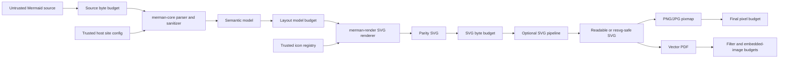

# Security Threat Model

**Status**: Living document  
**Last updated**: 2026-07-20
**Scope**: `merman-core`, `merman-render`, `merman`, and `merman-cli`

## Problem

`merman` renders user-authored Mermaid text without a browser. That removes browser-execution
surfaces such as Mermaid runtime callbacks, but the project still emits SVG, CSS, links, optional
HTML labels, raster images, and host-provided theme/icon content.

The main security goal is to make untrusted diagram source safe by default while preserving Mermaid
parity for consumers that intentionally need Mermaid-like SVG output.

## Architecture

```mermaid
flowchart LR
    Source[Untrusted Mermaid source] --> SourceBudget[Source byte budget]
    SourceBudget --> Core[merman-core parser and sanitizer]
    SiteConfig[Trusted host site config] --> Core
    Core --> Model[Semantic model]
    Model --> LayoutBudget[Layout model budget]
    LayoutBudget --> Render[merman-render SVG renderer]
    Icons[Trusted icon registry] --> Render
    Render --> Parity[Parity SVG]
    Parity --> SvgBudget[SVG byte budget]
    SvgBudget --> Pipeline[Optional SVG pipeline]
    Pipeline --> SafeSvg[Readable or resvg-safe SVG]
    SafeSvg --> Raster[PNG/JPG pixmap]
    SafeSvg --> Pdf[Vector PDF]
    Raster --> RasterBudget[Final pixel budget]
    Pdf --> PdfBudget[Filter and embedded-image budgets]
```

## Trust Boundaries

| Boundary | Trust level | Notes |
| --- | --- | --- |
| Mermaid source text | Untrusted | Includes labels, click URLs, class/style directives, frontmatter, and `%%{init}%%`. |
| Diagram-level config | Untrusted by default | Generated Mermaid config shape rejects unknown, null, and prototype-pollution directive keys. Merman's typed hardened `secure` policy prevents diagrams from changing high-risk config such as `securityLevel`, `fontFamily`, `themeCSS`, and `themeVariables`. |
| Site config | Trusted | Supplied by the embedding application. Use it for host policy, theme, and trusted CSS only. |
| Host theme and custom SVG pipeline | Trusted input to a bounded output contract | Custom postprocessors can inject arbitrary draft SVG/CSS. A `resvg_safe` terminal preset runs after every custom pass; parity/readable output may preserve host content. |
| Icon registry | Trusted | `IconSvg` bodies are injected as SVG fragments after ID scoping. `resvg_safe` cleans active output content, but parity/custom pipelines can preserve arbitrary icon SVG. Do not register user-supplied SVG without a trusted output path or external sanitizer. |
| Parity SVG output | Not a browser sanitizer | It preserves Mermaid-like DOM shape and may contain CSS or `<foreignObject>` needed for parity. |
| `ResvgCompatibleSvg` / `resvg_safe` output | Sealed consumer-oriented cleanup | The terminal finalizer removes known non-browser SVG consumer hazards and common active SVG constructs, then parses and validates the residual contract. It is not a complete browser XSS sanitizer. |

## Current Mitigations

| Threat | Mitigation | Coverage |
| --- | --- | --- |
| Diagram config introduces unknown keys, prototype-pollution keys, or unsafe dictionary values | Init directives are checked against the generated Mermaid 11.16 key shape; dictionary-style values use narrow upstream validators. | Core sanitizer unit tests and the end-to-end directive config test. |
| Diagram config downgrades `securityLevel` or injects CSS through config | The typed ten-key default site policy filters secure keys recursively before effective config is used. The pure upstream artifact remains six-key data. | Core config, parse metadata, and public render API tests. |
| Script or data URLs in labels and links | Mermaid-compatible `format_url` and `sanitize_url` logic, strict by default. | Core URL tests plus SVG integration tests. |
| HTML/script in labels | DOMPurify-inspired text sanitizer backed by generated allowlists when full sanitization is enabled. | Core sanitizer tests. |
| `<foreignObject>`, active SVG content, and unsupported CSS in export paths | `SvgPipeline::readable()` adds text fallbacks; the terminal `SvgPipeline::resvg_safe()` stage strips foreignObject, active SVG/SMIL elements, event attributes, unsafe URL attributes, unsafe style/presentation URL values, and unsupported CSS, then parses the final XML. Low-level PNG/JPG/PDF APIs require `ResvgCompatibleSvg`. | Pipeline tests, compile-fail construction proof, and public API regression tests. |
| Huge source, layout model, labels, or SVG output | Shared render resource budgets limit source bytes, Flowchart layout cardinality, aggregate label bytes, and SVG bytes before and after SVG postprocessing. | Render, bindings, Typst, and security regression tests. |
| Huge or malformed PNG/JPG output | `RasterOptions` plans fit, scale, final dimensions, and the default 4096-by-4096 / 16,777,216-pixel limits before pixmap allocation. Embedded image headers are checked before decode. Raster unbounded mode does not disable render or decoded-image budgets, and large SVG generation remains governed by the separate render resource profile. | Raster tests, public API regression tests, and CLI behavior. |
| Recursive SVG backend exhaustion | The sealed XML tree and resolved `usvg` tree retain a non-optional depth capability. Native preparation and encoding use a bounded 8 MiB worker stack; expanded `<use>` chains are rejected before `resvg` or `krilla-svg`. Raw vector SVG remains available for valid diagrams beyond this export capability. | Terminal SVG validation, expanded-tree adversarial tests, and native PNG/PDF depth smoke tests. |
| Expensive vector PDF internals | `PdfOptions` is independent of the PNG/JPG pixel limit. Page geometry remains vector, while localized filter bitmaps have an aggregate 33,554,432-pixel default budget and embedded raster images have separate per-image and aggregate budgets. | PDF planning tests, public API regression tests, and CLI behavior. |
| Parser/layout denial of service | Shared render budgets plus diagram-specific guards such as nesting and Gantt exclude expansion limits. Parser nesting limits remain separate because they protect recursive parse/config surfaces before layout budgets exist. | Core/render unit tests. |
| Raw style declaration breakouts | SVG style declaration helpers reject or escape known declaration and selector breakouts. | Render CSS tests. |

## Known Residual Risks

| Risk | Impact | Required host action |
| --- | --- | --- |
| Inline parity SVG in a browser with untrusted source | Browser SVG/HTML/CSS interpretation may create XSS or UI-redress risk if a future renderer path leaks active content. | Prefer `render_svg_resvg_safe_sync` for untrusted inline previews, enforce CSP, and run a browser-grade SVG sanitizer when the SVG crosses a web trust boundary. |
| Trusted site CSS is malicious or compromised | Host CSS can affect rendered output and may include browser-sensitive CSS. | Treat site config and host themes as code. Do not accept them from untrusted users. |
| Custom icon SVG is untrusted | Icon bodies are inserted as SVG fragments. `resvg_safe` strips common active content at the final output boundary, but parity SVG and custom host pipelines may preserve it. | Only load curated icon packs, force a trusted cleanup pipeline, or sanitize icons before registration. |
| `securityLevel = loose` in site config | Loose mode intentionally preserves more Mermaid behavior, including custom links. | Do not enable loose mode for untrusted diagrams unless the embedding context is already sandboxed. |
| `resvg_safe` is mistaken for a complete sanitizer | It targets renderer compatibility, not every browser XSS vector. | Use defense in depth for web embedding: CSP, sandboxing, and a dedicated sanitizer. |
| Dependency vulnerabilities | Parser, XML/HTML, image, and raster dependencies may receive future advisories. | `Security Audit` CI runs `cargo audit` on dependency changes and weekly; triage RustSec and upstream Mermaid advisories against this document. |
| Accepted large graph still consumes CPU inside a layout engine | Cardinality and byte limits reduce worst cases but do not preempt CPU once a graph is admitted. | Use tighter `resources` profiles for untrusted surfaces; add cooperative deadlines as follow-up if host workloads need hard CPU caps. |

## Output Guidance

| Use case | Recommended path | Extra controls |
| --- | --- | --- |
| Golden parity tests | `render_svg_sync` | Only compare or store as artifact; do not expose as trusted browser HTML. |
| Editor preview for untrusted markdown | `render_svg_resvg_safe_sync` or host pipeline based on it | CSP, no user-controlled site config, stable diagram IDs. |
| Server-side PNG/JPG | Raster APIs, which apply the resvg-safe pipeline and `RasterOptions` pixmap budgets | Keep budgets enabled for untrusted input; use `with_fit_to` for previews and `with_unbounded_size` only for trusted oversized exports. Embedded-image budgets remain independent. |
| Server-side vector PDF | PDF APIs with `PdfOptions` | Select an explicit page policy. Keep filter-rasterization and embedded-image budgets enabled for untrusted input; do not use PNG/JPG unbounded settings as a PDF policy. |
| Trusted internal design system diagrams | `render_svg_sync` or host theme pipeline | Keep trusted theme/icon sources reviewable. |
| User-uploaded custom icon packs | Not directly supported as safe input | Sanitize externally before `IconRegistry` registration. |

## Alternatives Considered

### Option A: Keep Mermaid parity as default and document explicit security boundaries

**Decision**: Chosen.  
**Pros**: Preserves baseline comparisons, avoids surprising DOM drift, and lets hosts pick the
right output contract.  
**Cons**: Consumers must understand that parity SVG is not a universal browser sanitizer.

### Option B: Always run a strict SVG sanitizer before returning SVG

**Decision**: Rejected for the default path.  
**Pros**: Simpler consumer story for untrusted web embedding.  
**Cons**: Breaks Mermaid DOM parity, removes legitimate Mermaid features such as HTML labels, and
would make upstream fixture comparison less meaningful.

### Option C: Add a future `untrusted_web_svg` preset

**Decision**: Deferred.  
**Pros**: Could provide a stricter browser-embedding contract than `resvg_safe`.  
**Cons**: Requires a precise browser SVG security policy and broader regression corpus; premature
without consumer demand and sanitizer validation.

## Security Regression Checklist

- Diagram-level `%%{init}%%` cannot override default secure keys for effective rendering.
- Init directives reject unknown, null, `__`, `proto`, and `constr` keys while retaining legal
  function and explicit-`undefined` keys from the generated shape.
- Dictionary-style `nodeColors`, `filenameIcons`, and `extensionIcons` preserve valid user keys but
  reject suspicious keys and invalid values.
- Strict-mode click URLs do not emit `javascript:` or other unsafe hrefs.
- Loose HTML labels rendered through `resvg_safe` do not retain `<foreignObject>` or active HTML.
- `resvg_safe` strips unsupported CSS patterns such as `@keyframes`, `:root`, and animation
  declarations, plus active SVG elements, event attributes, unsafe URL attributes, and unsafe
  style/presentation URL values in raw SVG and rendered icon fragments.
- Raster tests keep enforcing size limits for unusually large `viewBox` values before PNG/JPG
  pixmap allocation, while still allowing the same finite geometry through the uncapped SVG path.
- PDF tests keep vector page sizing independent from PNG/JPG limits and enforce separate aggregate
  filter-bitmap and embedded-image decode budgets.
- Resource-limit tests keep enforcing source bytes, Flowchart model cardinality, aggregate label
  bytes, and SVG bytes through Rust and binding surfaces.
- New diagram families identify label, URL, style, and config merge points during admission.

## Success Criteria

| Metric | Target | Measurement |
| --- | --- | --- |
| Secure-key regression coverage | Public render API covered | `cargo nextest run -p merman --features render --test security_regression` |
| URL sanitizer coverage | Unsafe URL cases stay blocked in strict mode | Core URL tests plus SVG regression tests |
| SVG cleanup coverage | `resvg_safe` output remains XML-parseable and free of known raster hazards | Pipeline and integration tests |
| Raster budget coverage | Oversized intrinsic SVGs do not allocate unbounded PNG/JPG pixmaps | `cargo nextest run -p merman --features raster --test security_regression` |
| PDF budget coverage | Oversized vector page geometry remains supported while filter bitmaps and embedded raster images stay within independent defaults | `cargo nextest run -p merman --features raster --test security_regression` plus PDF planning tests |
| Render resource budget coverage | Oversized source/model/SVG failures classify as resource limits | `cargo nextest run -p merman --features render --test security_regression`; `cargo nextest run -p merman-bindings-core --features render,elk-layout` |
| Advisory triage | Every relevant RustSec or upstream Mermaid advisory maps to mitigation, non-applicability, or follow-up | `Security Audit` CI plus updates to this document and `CHANGELOG.md` |

## Future Work

- Add a stricter browser-embedding SVG preset if consumers need inline SVG without an external
  sanitizer.
- Add optional icon SVG sanitization helpers for hosts that cannot fully trust icon packs.
- Expand layout-model budgets beyond Flowchart and add optional cooperative layout deadlines for
  hosts that need hard CPU preemption.
- Add a broader dependency policy gate, such as license and duplicate-version checks, if release
  review needs more than RustSec advisory scanning.
