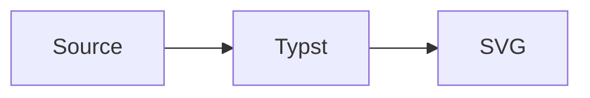

# merman

Render Mermaid diagrams in Typst with the `merman` Rust renderer.

`merman` embeds a WebAssembly plugin so Typst documents can render Mermaid diagrams directly during compilation while reusing the parser, layout, and SVG renderer from the broader `merman` project.

## Quick Start

Import `mermaid` and pass a Mermaid source string:

```typst
#import "@preview/merman:0.1.0": mermaid

#mermaid("
flowchart TD
  A[Write Mermaid] --> B[Render with merman]
  B --> C[Embed SVG in Typst]
")
```

## Version Mapping

| Typst package | merman source version | Notes |
| --- | --- | --- |
| `0.1.0` | `0.8.0-alpha.2` | Initial Typst package built from the 0.8 alpha line; Typst package versions advance independently. |

## Examples

- [basic.typ](examples/basic.typ): minimal `#mermaid(...)` usage.
- [document-context.typ](examples/document-context.typ): opt-in document typography and width bridging.
- [profile.typ](examples/profile.typ): reusable renderer settings shared by direct calls and raw blocks.
- [figure.typ](examples/figure.typ): Mermaid diagrams wrapped as Typst figures with reusable layout defaults.
- [raw-block.typ](examples/raw-block.typ): document-wide Mermaid fences with `show-mermaid-blocks`.
- [options.typ](examples/options.typ): themes, stable ids, `mermaid-result`, SVG export, and placeholder errors.
- [print.typ](examples/print.typ): print-friendly white-background output.
- [presentation.typ](examples/presentation.typ): dark slide-sized output.
- [svg-export.typ](examples/svg-export.typ): raw SVG and structured render payloads.

## Document Fonts

`mermaid(...)` is explicit-only by default. It does not automatically inherit the surrounding Typst font, text size, or container width.

Pass `document-context: true` to content-rendering APIs when you want opt-in document context bridging. This forwards the current Typst text font, text size, and available width as renderer options unless you override them directly.

```typst
#mermaid(source, document-context: true, width: 100%)

#show raw.where(lang: "mermaid"): show-mermaid-blocks(
  document-context: true,
  width: 100%,
)
```

You can also pass typography intent explicitly:

```typst
#mermaid(
  source,
  typography: (
    font: ("Source Sans 3", "Arial", "sans-serif"),
    size: "16px",
  ),
)
```

This changes the SVG style intent sent to the headless renderer. It does not mean the Typst plugin measured the exact Typst font file. Current measurement modes are the built-in `vendored` and `deterministic` measurers; browser-style host callbacks and Typst font-asset measurement are not automatic.

Check the compiled plugin capability surface with:

```typst
#let capabilities = merman-capabilities()
#capabilities.text_measurement
```

## Profiles

Use `mermaid-profile(...)` for reusable diagram settings:

```typst
#let diagrams = mermaid-profile(
  typography: (
    font: ("Source Sans 3", "Arial", "sans-serif"),
    size: "16px",
  ),
  background: "#ffffff",
  theme-name: "base",
  figure: (
    placement: bottom,
    scope: "parent",
    caption-position: top,
    gap: 1em,
    outlined: false,
  ),
)

#mermaid(source, profile: diagrams, width: 100%)
#mermaid-figure(source, profile: diagrams, caption: [System flow], width: 100%)
```

Profiles work with `mermaid(...)`, `mermaid-figure(...)`, `mermaid-svg(...)`, `mermaid-result(...)`, `validate-mermaid(...)`, and raw-block show rules. The optional `figure` section is consumed only by `mermaid-figure(...)`; it does not change raw SVG rendering or non-figure image calls.

Precedence is:

1. `options`
2. direct parameters such as `host-theme`, `layout`, `viewport-width`, and `pipeline`
3. direct `typography`
4. profile values
5. context-derived font, size, and width
6. package and renderer defaults

## Raw Blocks

Use `show-mermaid-blocks` with Typst's `raw.where` selector:

~~~typst
#import "@preview/merman:0.1.0": show-mermaid-blocks

#show raw.where(lang: "mermaid"): show-mermaid-blocks(width: 100%)


~~~

Avoid setting a fixed `id` in a document-wide raw-block show rule unless the document has only one Mermaid block; otherwise multiple diagrams will share the same SVG id.

For document-context-aware rendering, pass `document-context: true`. This reads the current Typst text font, text size, and container width inside `context`, then forwards them to the renderer.

~~~typst
#import "@preview/merman:0.1.0": show-mermaid-blocks

#show raw.where(lang: "mermaid"): show-mermaid-blocks(
  document-context: true,
  width: 100%,
)
~~~

## API Migration

This refactor intentionally removes compatibility-only context wrappers:

```typst
// Old:
#mermaid-context(source, width: 100%)
#show raw.where(lang: "mermaid"): show-mermaid-blocks-context(width: 100%)

// New:
#mermaid(source, document-context: true, width: 100%)
#show raw.where(lang: "mermaid"): show-mermaid-blocks(
  document-context: true,
  width: 100%,
)
```

`context` is a Typst keyword, so the public parameter is named `document-context`.

## API

### `mermaid(source, ..)`

Renders a Mermaid string or raw block as an SVG image.

Common parameters:

- `width`, `height`, `fit`, `alt`: forwarded to Typst's `image`.
- `scale`: wraps the rendered image with Typst `scale`; accepts ratios such as `120%` or numbers such as `1.2`.
- `document-context`: `false` by default. Set to `true` to inherit Typst text font, text size, and available width for image rendering.
- `profile`: reusable options produced by `mermaid-profile(...)`.
- `typography`: high-level font and size intent, mapped to the current `host-theme` fields.
- `pipeline`: `"resvg-safe"` by default for Typst rendering. Use `"parity"` when you need Mermaid-like SVG DOM output, or `"readable"` for inline SVG inspection.
- `id`: stable SVG root id. `diagram-id` is kept as the lower-level binding name and takes precedence when both are provided.
- `background`: SVG root background color, mapped to `svg.root_background_color`.
- `theme-name`: Mermaid theme name, such as `"base"` or `"dark"`.
- `theme`: Mermaid `themeVariables`.
- `site-config`: full Mermaid site config object.
- `host-theme`: merman host theme profile object.
- `layout`: full binding layout object. This overrides the shorthand layout parameters below.
- `text-measurer`: `"vendored"` or `"deterministic"`.
- `viewport-width`, `viewport-height`, `math-renderer`: layout shorthands.
- `scoped-css`, `css-override-policy`, `drop-native-duplicate-fallbacks`: advanced SVG post-processing shorthands.
- `fixed-today`: `YYYY-MM-DD` for date-sensitive diagrams.
- `error-mode`: `"panic"` by default. Use `"placeholder"` or `"text"` to show diagram errors in the document instead of failing the Typst compile. These modes handle structured errors returned by `merman`; missing wasm files, Typst plugin loading failures, invalid `error-mode` values, and SVG image decoding failures still fail the Typst compile.
- `options`: escape hatch; when present, it is passed through directly to the Rust binding options and overrides shorthand parameters.

This entry point is explicit-only unless `document-context: true` is set.

### `mermaid-profile(..)`

Returns a reusable profile dictionary. Profiles normalize into the same binding options used by direct parameters, so they do not create a second rendering path.

### `mermaid-figure(source, ..)`

Renders a Mermaid diagram and wraps it in a Typst `figure`.

Use `document-context: true` when the figure should opt into the same document-context bridge as `mermaid(...)`.

Figure layout parameters are forwarded to Typst's native `figure`: `placement`, `scope`, `supplement`, `numbering`, `gap`, and `outlined`. Use `caption-position` and `caption-separator` when you need a top caption or document-specific caption separator. Direct figure parameters override `profile.figure` defaults.

### `mermaid-svg(source, ..)`

Returns the rendered SVG as a string instead of embedding it as an image.

This value-returning API does not enter Typst `context`; pass `typography`, `host-theme`, `layout`, or `viewport-width` explicitly when exporting SVG text.

### `mermaid-result(source, ..)`

Returns a structured render payload:

```typst
#let result = mermaid-result("flowchart TD\nA --> B")
#if result.ok {
  result.svg
} else {
  result.message
}
```

### `validate-mermaid(source, ..)`

Returns the validation payload produced by the Rust bindings:

```typst
#let result = validate-mermaid("flowchart TD\nA --> B")
#result.code_name
```

### `merman-capabilities()`

Returns the compiled plugin capability payload, including the current text measurement boundary:

```typst
#let capabilities = merman-capabilities()
#capabilities.text_measurement.vendored
```

### `show-mermaid-blocks(..)`

Returns a raw block show handler. This is the shortest way to enable Mermaid fences across a Typst document:

```typst
#show raw.where(lang: "mermaid"): show-mermaid-blocks(width: 100%)
```

## Development

The Typst package uses its own version track and is not locked to the Rust crate version.

Build the default Typst package locally:

```sh
cargo run -p xtask -- build-typst-package
```

The package is written to:

```sh
dist/typst/merman/0.1.0
```

For local `@preview` smoke tests, copy the built package under a preview namespace package path and compile with `--package-path`:

```sh
cargo run -p xtask -- typst-package-smoke --skip-wasm-build
```

The default package build is the publish profile and enables `render`, `core-full`, and `elk-layout`.
Build the no-ELK full-config artifact with:

```sh
cargo run -p xtask -- build-typst-package --profile full
```

Build the protocol-only transport with:

```sh
cargo run -p xtask -- build-typst-package --profile minimal
```

## Current Limits

- Output is SVG embedded through Typst `image`; diagrams are not Typst-native vector elements.
- Font family and size can be forwarded as style intent, but exact Typst font glyph measurement is not automatic.
- Browser-only Mermaid interactions such as script callbacks and popup behavior are not expected to work in static Typst output.
- The package is smoke-tested with Typst 0.15.0. Typst 0.15 HTML export remains experimental and is not a package promise here.
- The `readable` and `parity` pipelines can embed SVG structures that Typst warns about; `resvg-safe` is the intended embedded-image path for package output.
