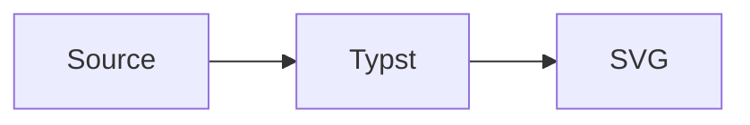

# merman

Render Mermaid diagrams in Typst with the `merman` Rust renderer.

This package is currently experimental and local-only. The goal is to provide a
Typst-native package experience while reusing the same parser, layout, and SVG
renderer used by the rest of `merman`.

## Local Usage

Build the default minimal Typst package:

```sh
cargo run -p xtask -- build-typst-package
```

The package is written to:

```sh
dist/typst/merman/0.7.0
```

Compile an example from the built package:

```sh
typst compile --root dist/typst/merman/0.7.0 \
  dist/typst/merman/0.7.0/examples/options.typ \
  target/typst-smoke/options.pdf
```

Example documents:

- `basic.typ`: minimal `#mermaid(...)` usage.
- `raw-block.typ`: document-wide Mermaid fences with `show-mermaid-blocks`.
- `options.typ`: themes, stable ids, `mermaid-result`, SVG export, and
  placeholder errors.
- `print.typ`: print-friendly white-background output.
- `presentation.typ`: dark slide-sized output.
- `svg-export.typ`: raw SVG and structured render payloads.

For a Typst `@local` install, copy that directory to your Typst package path:

```sh
mkdir -p "$HOME/Library/Application Support/typst/packages/local/merman"
cp -R dist/typst/merman/0.7.0 "$HOME/Library/Application Support/typst/packages/local/merman/"
```

Then import it from a Typst document:

```typst
#import "@local/merman:0.7.0": mermaid

#mermaid("
flowchart TD
  A --> B
")
```

## Raw Blocks

Use `show-mermaid-blocks` with Typst's `raw.where` selector:

~~~typst
#import "@local/merman:0.7.0": show-mermaid-blocks

#show raw.where(lang: "mermaid"): show-mermaid-blocks(width: 100%)


~~~

Avoid setting a fixed `id` in a document-wide raw-block show rule unless the
document has only one Mermaid block; otherwise multiple diagrams will share the
same SVG id.

## API

### `mermaid(source, ..)`

Renders a Mermaid string or raw block as an SVG image.

Common parameters:

- `width`, `height`, `fit`, `alt`: forwarded to Typst's `image`.
- `scale`: wraps the rendered image with Typst `scale`; accepts ratios such
  as `120%` or numbers such as `1.2`.
- `pipeline`: `"resvg-safe"` by default for Typst rendering. Use `"parity"`
  when you need Mermaid-like SVG DOM output, or `"readable"` for inline SVG
  inspection.
- `id`: stable SVG root id. `diagram-id` is kept as the lower-level binding
  name and takes precedence when both are provided.
- `background`: SVG root background color, mapped to
  `svg.root_background_color`.
- `theme-name`: Mermaid theme name, such as `"base"` or `"dark"`.
- `theme`: Mermaid `themeVariables`.
- `site-config`: full Mermaid site config object.
- `host-theme`: merman host theme profile object.
- `layout`: full binding layout object. This overrides the shorthand layout
  parameters below.
- `text-measurer`: `"vendored"` or `"deterministic"`.
- `viewport-width`, `viewport-height`, `math-renderer`: layout shorthands.
- `scoped-css`, `css-override-policy`, `drop-native-duplicate-fallbacks`:
  advanced SVG post-processing shorthands.
- `fixed-today`: `YYYY-MM-DD` for date-sensitive diagrams.
- `error-mode`: `"panic"` by default. Use `"placeholder"` or `"text"` to
  show diagram errors in the document instead of failing the Typst compile.
  These modes handle structured errors returned by `merman`; missing wasm files,
  Typst plugin loading failures, invalid `error-mode` values, and SVG image
  decoding failures still fail the Typst compile.
- `options`: escape hatch; when present, it is passed through directly to the
  Rust binding options and overrides shorthand parameters.

### `mermaid-svg(source, ..)`

Returns the rendered SVG as a string instead of embedding it as an image.

### `mermaid-result(source, ..)`

Returns a structured render payload:

```typst
#let result = mermaid-result("flowchart TD\nA --> B")
#if result.ok {
  result.svg
} else {
  result.message
}
```

### `validate-mermaid(source, ..)`

Returns the validation payload produced by the Rust bindings:

```typst
#let result = validate-mermaid("flowchart TD\nA --> B")
#result.code_name
```

### `mermaid-raw(block, ..)`

Convenience wrapper for raw blocks. This is intended for `#show raw.where(...)`
rules.

### `show-mermaid-blocks(..)`

Returns a raw block show handler. This is the shortest way to enable Mermaid
fences across a Typst document:

```typst
#show raw.where(lang: "mermaid"): show-mermaid-blocks(width: 100%)
```

## Full Config/Sanitizer Build

The default package build is size-oriented and does not enable `core-full`.
Build the larger full-config/full-sanitization artifact with:

```sh
cargo run -p xtask -- build-typst-package --profile full
```

## Release Checklist

- Build the package with `cargo run -p xtask -- build-typst-package`.
- Run `cargo test -p merman-typst-plugin`.
- Run the Typst wasm ABI and size gate:
  `cargo run -p xtask -- profile-budget check-wasm --profile typst-wasm --wasm target/wasm32-unknown-unknown/wasm-size/merman_typst_plugin.wasm`.
- Compile every file in `dist/typst/merman/0.7.0/examples`.
- Smoke-test an `@local/merman:0.7.0` import with `--package-path` or the
  system Typst package path.
- Confirm `typst.toml` metadata, license files, and README examples are ready
  before submitting to Typst Universe.

## Current Limits

- Output is SVG embedded through Typst `image`; diagrams are not Typst-native
  vector elements.
- Browser-only Mermaid interactions such as script callbacks and popup behavior
  are not expected to work in static Typst output.
- The Typst package is not yet published to Typst Universe.
